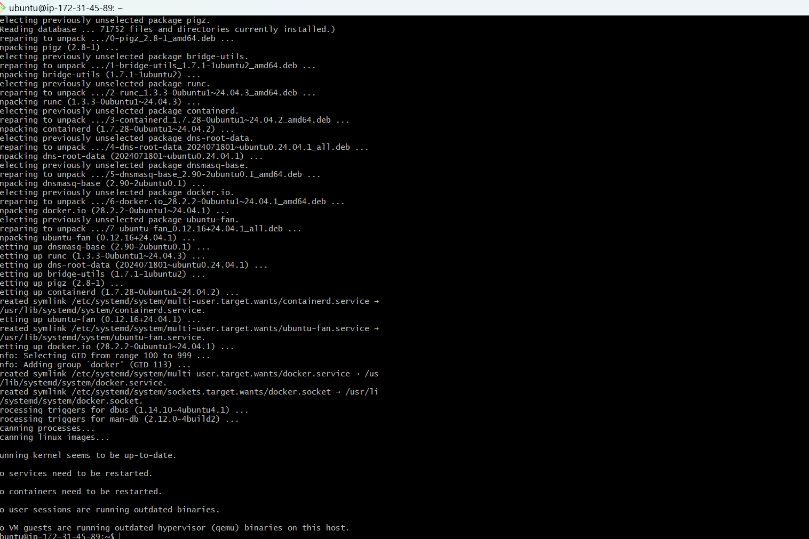
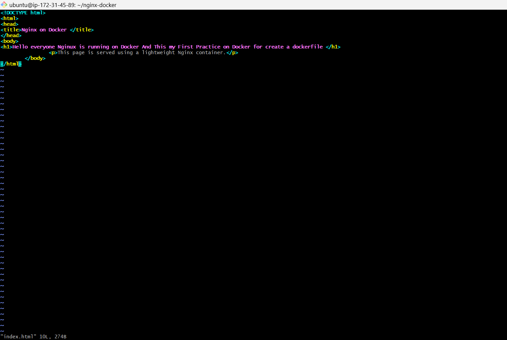
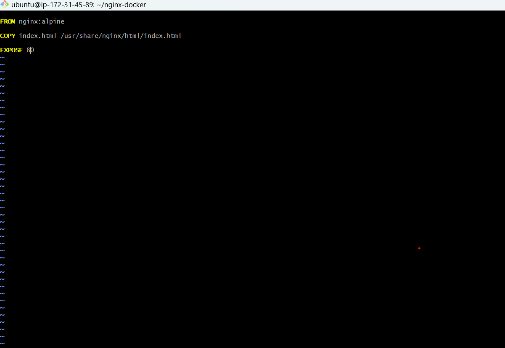
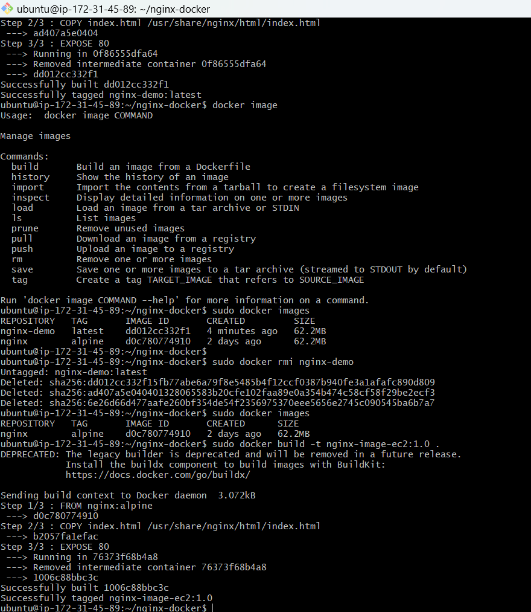
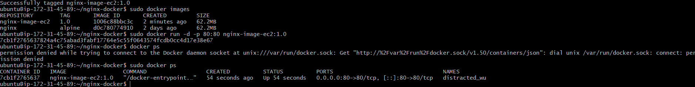
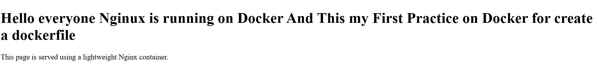
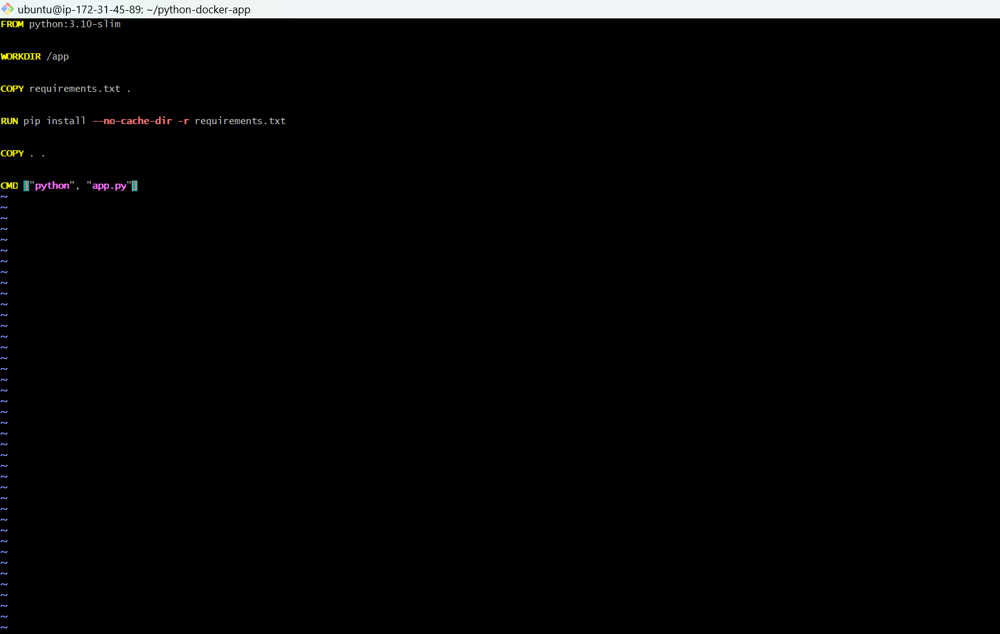
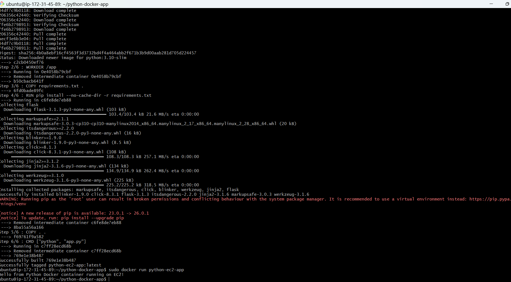

Hello , Just created README.MD here Checking purpose
Task 1: Create a Basic Dockerfile for Nginx

In Task1   I :

1.Launched an Amazon EC2 Ubuntu instance 
Then updated 
sudo apt update

2.Installed Docker On EC2

sudo apt install docker.io -y

sudo systemctl start docker
sudo systemctl enable docker

3.Created a Dockerfile using lightweight nginx:alpine image
  vim  Dockerfile
  

4.Built the docker image
    sudo docker build -t nginx-image-ec2:1.0 .

  

 5 Run the container
   
     sudo docker run -d -p 80:80 nginx-image-ec2:1.0

  

7.Successfully served a webpage from the Docker container

 

 Task 2: Create Dockerfile for Python
 Objective

 Create a Dockerfile to containerize a Python application so it can run consistently across environments.

   Project Structure:

python-app/
│
├── app.py
├── requirements.txt
└── Dockerfile

 
     

Dockerfile:

  

  Build the Docker Image and Run the Container

  

  Task2 Completed:

1.Created Python app

2.Created Dockerfile

3.Built Docker image

4.Ran container on EC2 Ubuntu

 

